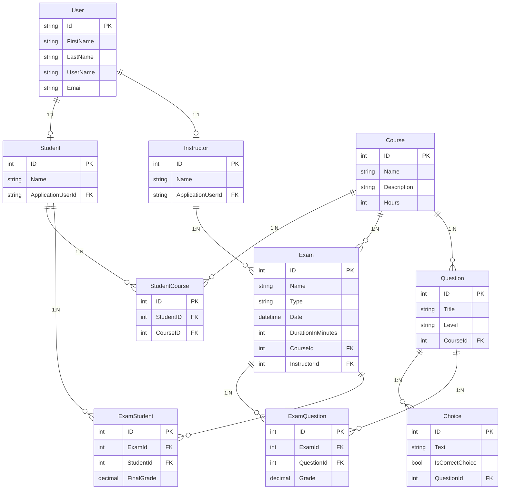
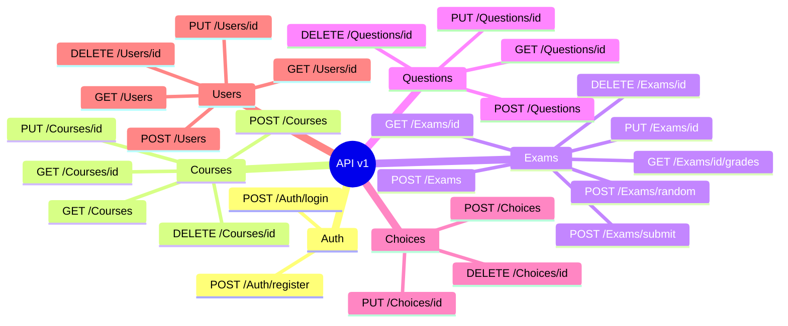

# Examination System Web API

<div align="center">


**A highly maintainable, scalable, and testable Examination System API built on N-Tier Architecture**

[Features](#-highlighted-features) • [Architecture & ADRs](#-architecture-decision-records-adrs) • [Database](#️-database) • [Testing](#-unit-testing) • [Getting Started](#-getting-started)

</div>

---


## 📖 Overview

Examination System is a Web API for managing online exams in an educational environment.

The system allows admins and instructors to manage courses, questions, exams, students, and exam assignments. Students can take assigned exams, submit their answers, and receive calculated grades automatically.
The project was built with ASP.NET Core, Entity Framework Core, SQL Server, ASP.NET Core Identity, and JWT authentication. It follows an N-Tier architecture to keep the API, business logic, and data access layers separated and easier to maintain.

---

## ✨ Highlighted Features

- **🏢 N-Tier Architecture**: Strict separation of concerns keeping the Presentation, Business Logic, and Data Access layers independent.
- **🛡️ Custom Middlewares**:
  - `GlobalErrorHandlerMiddleware`: Centralized exception handling to ensure consistent API error responses globally.
  - `TransactionMiddleware`: Automatically manages database transactions per request to guarantee data integrity during complex flows (like exam submission).
- **🔍 Advanced Queries & Pagination**: Efficient data retrieval using server-side pagination to handle large datasets of students, courses, or exam results.
- **🎲 Dynamic Random Exams**: Ability to automatically generate random exams based on specific configurations (question counts, difficulty levels, and grades per course).
- **💯 Automated Grading Engine**: Secure evaluation of submitted student answers against correct choices, calculating final grades automatically.
- **🗄️ Repository Pattern**: Implementing `GenericRepository` alongside specific repositories to completely decouple data access logic from business services.
- **🔐 Security & Identity**: Comprehensive JWT-based Authentication and Authorization leveraging ASP.NET Core Identity for Role Management (Admin, Instructor, Student).
- **🗺️ Object Mapping**: Using `AutoMapper` to map between Domain Entities, DTOs, and ViewModels smoothly.
- **✔️ FluentValidation Pipeline**: Completely isolated DTO validation using `FluentValidation`, automatically intercepting bad requests before they ever hit the controllers, ensuring perfectly clean APIs.
- **🧪 Comprehensive Unit Testing**: 30+ tests validating all major business logic services using Moq and FluentAssertions.
- **📊 Observability & Structured Logging**: Centralized and structured logging using Serilog and Seq to monitor application health, track user journeys, and quickly debug issues.

---

## 🏗️ Architecture

```text
┌─────────────────────────────────────────────┐
│             ExaminationSystem               │  ← Presentation Layer (API)
│          Controllers · Middlewares          │
└─────────────────┬───────────────────────────┘
                  │
┌─────────────────▼───────────────────────────┐
│           ExaminationSystem.BLL             │  ← Business Logic Layer (BLL)
│       Services · DTOs · AutoMapper          │
└─────────────────┬───────────────────────────┘
                  │
┌─────────────────▼───────────────────────────┐
│           ExaminationSystem.DAL             │  ← Data Access Layer (DAL)
│   DbContext · Repositories · Models/Entities│
└─────────────────────────────────────────────┘
```


## 🏗️ Architecture Decisions

This section explains the main technical decisions behind the project and why they were used.

### 1. Why N-Tier Architecture?

The project uses N-Tier Architecture to separate the application into three main layers:

- **API Layer**: Handles HTTP requests, controllers, authentication, and authorization.
- **Business Logic Layer (BLL)**: Contains services, DTOs, validation, and application rules.
- **Data Access Layer (DAL)**: Contains Entity Framework Core, repositories, migrations, and database models.

This structure keeps controllers focused on handling requests, while the business logic stays inside services and database access stays inside repositories.

For this project, N-Tier was a good fit because the system is mainly data-driven and has clear modules such as courses, exams, questions, students, and grades.

**Trade-off:**  
Compared to Clean Architecture, the domain models are closer to the data access layer. This is acceptable for the current project size, but if the project grows, moving the domain models into a separate Domain layer would make the design more flexible.

### 2. Why Generic Repository Pattern?

The project uses a generic repository to keep common database operations in one place.

Instead of repeating methods like adding, updating, deleting, checking existence, and querying entities in every repository, these shared operations are implemented once in `IRepository<T>` and reused across the application.

This makes the service layer easier to test because repositories can be mocked during unit testing.

For more specific queries, such as loading an exam with its questions and choices, dedicated repository methods can still be added when needed.

**Trade-off:**  
Entity Framework Core already provides repository-like behavior through `DbContext` and `DbSet`. Because of that, the generic repository should stay simple and should not try to hide every EF Core feature.


---

## 🗄️ Database



---

## 🛠️ Technology Stack

| Technology | Purpose |
|------------|---------|
| **.NET 10 / ASP.NET Core** | Web API framework |
| **Entity Framework Core** | ORM + Code-First migrations |
| **SQL Server** | Primary database |
| **ASP.NET Core Identity** | User Management & Roles |
| **AutoMapper** | Object-to-object mapping (Entities ↔ DTOs) |
| **JWT** | Secure authentication and authorization |
| **Moq & NUnit** | Unit testing |

---

## 📂 Project Structure

```text
ExaminationSystem/
│
├── 🌐 ExaminationSystem          # API Layer (Controllers, Program.cs)
├── ⚙️ ExaminationSystem.BLL      # Business Logic (Services, DTOs, AutoMapper)
├── 🔌 ExaminationSystem.DAL      # Data Access (Models, DbContext, Repositories)
└── 🧪 ExaminationSys.UnitTests   # NUnit Test Project for Services
```

---

## 📚 API Documentation



---

## 🧪 Unit Testing

### 🗂️ Test Project Structure
All unit tests live in the `ExaminationSys.UnitTests` project and ensure 100% service-level logic coverage across the BLL.

| Tool | Role |
|---|---|
| **NUnit** | Test framework (`[TestFixture]`, `[Test]`, `[SetUp]`) |
| **Moq** | Mocking generic repositories and dependencies |
| **FluentAssertions** | Expressive, readable assertions |
| **MockQueryable** | Mocking asynchronous EF Core LINQ extensions |

### ✅ Test Results Summary

```text
Passed!  - Failed: 0, Passed: 32, Skipped: 0, Total: 32
```

| Test File | Tests | Core Logic Covered |
|---|---|---|
| `QuestionServiceTests.cs` | 3 | Add, Delete, Exception Handling |
| `ExamServiceTests.cs` | 2 | Add, Cross-Service Validation |
| `ExamStudentServiceTests.cs` | 3 | Add, Check Assignation |
| `CourseServiceTests.cs` | 4 | Add, GetById, Failure scenarios |
| `ExamQuestionServiceTests.cs` | 3 | Add, Delete, IsExist |
| `StudnetCourseServiceTests.cs`| 3 | Assign, Validation checks |
| `UserServiceTests.cs` | 3 | IsExist, GetById, Identity Store Mocking |
| `AuthServiceTests.cs` | 3 | Register, GetToken, Role validation |
| `StudentServiceTests.cs` | 2 | Check Existence |
| `InstructorServiceTests.cs` | 2 | Check Existence |
| `ChoiceServiceTests.cs` | 4 | Add, Delete by Question, Validation |
| **Total** | **32** | |

---

## 🚀 Getting Started

### Prerequisites
- .NET SDK (10.0 or later)
- SQL Server

### Setup

1. **Clone the repository:**
   ```bash
   git clone https://github.com/Abdelrhman-elsaeed/ExaminationSystem.git
   cd ExaminationSystem
   ```

2. **Database Configuration:**
   Update the connection string in `appsettings.json` to point to your local SQL Server instance.

3. **Apply Migrations:**
   Ensure your database is created and up to date by running EF Core migrations.

4. **Run the API:**
   ```bash
   dotnet run --project ExaminationSystem
   ```

5. **Explore:** Open the browser and navigate to `https://localhost:<port>/swagger` to test the endpoints interactively.

---

## 🔮 Roadmap & Future Enhancements

To demonstrate scalability awareness and readiness for enterprise-level demands, the following architectural upgrades are planned for the next iteration:

- **🚀 Distributed Caching (Redis)**
  - Implement Redis to cache read-heavy, infrequently changing data such as the `Course` catalog and `Exam` definitions. This will drastically reduce database hits and improve endpoint response times.
  - *Strategy*: Use the Cache-Aside pattern with robust invalidation policies upon data modification.

- **📨 Event-Driven Architecture (RabbitMQ)**
  - Offload the `SubmitExam` grading process to a background worker using a message broker. When a student submits an exam, publish an `ExamSubmittedEvent`. A consumer will pick it up, grade it asynchronously, and trigger an email notification, ensuring the API remains highly responsive during peak exam periods.

- **📦 Containerization (Docker)**
  - Dockerize the API and its dependencies (SQL Server, Redis) into isolated containers using `docker-compose`, ensuring a consistent "works on my machine" experience across all deployment environments.

---

<div align="center">

*This README was designed not just to explain how to run the project, but to document the engineering mindset and architectural decisions behind it.*

**⭐ Star this repository if you find it helpful!**

Made with ❤️ using .NET 10

</div>
