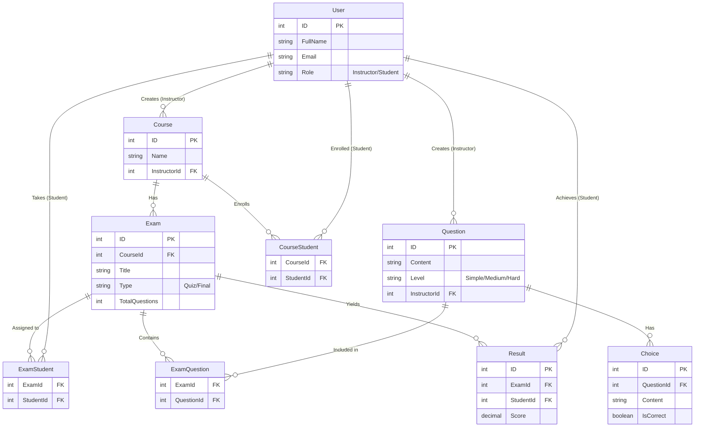

# 🎓 Examination System Web API

<div align="center">


**A robust, scalable, and highly maintainable backend API for managing online courses, quizzes, and final exams.**

[Features](#-highlighted-features) • [Architecture](#-architecture) • [Database](#️-database) • [Roadmap](#-roadmap--status) • [Getting Started](#-getting-started)

</div>

---

## 📖 Overview

**Examination System** is an online platform backend designed to allow instructors to create and manage courses, question banks, and exams. Students can enroll in courses, take assigned quizzes and a final exam, and receive automated evaluations. Built with **.NET Core**, **Entity Framework Core**, and adhering to clean architectural principles.

---

## ✨ Highlighted Features

- **🧑‍🏫 Role-Based Workflows**: Distinct capabilities for `Instructors` (manage courses, questions, exams) and `Students` (take exams, view results).
- **🔒 Security & Identity**: Currently migrating to **ASP.NET Core Identity** for robust, standard-compliant authentication and authorization, replacing custom implementations.
- **📚 Course & Enrollment Management**: Instructors can create courses and assign students to them. Students must be enrolled before taking exams.
- **📝 Intelligent Exam Generation**: 
  - **Manual Assignment**: Instructors can hand-pick questions for an exam.
  - **Automatic Assignment**: The system can automatically generate an exam, intelligently balancing questions based on their difficulty level (Simple, Medium, Hard).
- **🛡️ Strict Business Rules**: 
  - Instructors are securely isolated to view only the courses, questions, and exams they created.
  - Students can take multiple quizzes but are restricted to taking **only one final exam** per course.
- **📊 Automated Evaluation**: System instantly evaluates submitted exams and calculates scores for students to view immediately.

---

## 🏗️ Architecture

Following modern enterprise patterns, the system is designed to decouple business logic from infrastructure and presentation.

```text
┌─────────────────────────────────────────────┐
│          ExaminationSystem.API              │  ← Presentation Layer (Controllers)
└─────────────────┬───────────────────────────┘
                  │
┌─────────────────▼───────────────────────────┐
│          ExaminationSystem.BLL              │  ← Business Logic Layer (Services/Handlers)
└─────────────────┬───────────────────────────┘
                  │
┌─────────────────▼───────────────────────────┐
│          ExaminationSystem.DAL              │  ← Data Access Layer (EF Core, Repositories)
└─────────────────────────────────────────────┘
```

> **Note:** The architecture is designed to support the separation of concerns, making the system highly testable and maintainable as it scales.

---

## 🗄️ Database (Entity Relationship)



---

## 🛠️ Technology Stack

| Technology | Purpose |
|------------|---------|
| **.NET Core** | Primary backend framework |
| **ASP.NET Core Identity** | Authentication & Authorization *(In Progress)* |
| **Entity Framework Core** | Code-First ORM for Data Access |
| **SQL Server** | Primary relational database |

---

## 📌 Roadmap & Status

This project is actively under development. Below are the key requirements extracted from the SRS and their current implementation status.

- [x] Initial Project Architecture Setup (API, BLL, DAL)
- [x] Base Database Entities and EF Core Configurations
- [ ] **Migrate to ASP.NET Core Identity** *(Replacing custom authorization)* 🔄
- [ ] **Course Management:** Create, Edit, Delete, and Student Enrollment functionality
- [ ] **Question Bank Management:** Add/Edit/Delete questions with Difficulty Levels (Simple, Medium, Hard) and multiple choices
- [ ] **Data Isolation:** Ensure instructors can only view/manage their own courses and questions
- [ ] **Exam Management:** Support for both `Quiz` and `Final` exam types
- [ ] **Exam Generation Logic:** 
  - [ ] Manual Question Assignment
  - [ ] Automatic Question Assignment (balancing difficulty levels)
- [ ] **Student Exam Rules Engine:** 
  - [ ] Verify student is assigned to the course before taking exams
  - [ ] Enforce rule: Multiple Quizzes allowed, but **only one Final Exam**
- [ ] **Result Evaluation:** Automated grading system upon exam submission

---

## 🚀 Getting Started

### Prerequisites
- .NET SDK
- SQL Server

### Setup

1. **Clone the repository:**
   ```bash
   git clone <your-repo-url>
   cd ExaminationSystem
   ```

2. **Database Configuration:**
   Update the connection string in `appsettings.json` to point to your local SQL Server instance.

3. **Apply Migrations:**
   Run EF Core migrations to build the database schema.
   ```bash
   dotnet ef database update
   ```

4. **Run the API:**
   ```bash
   dotnet run
   ```

---

<div align="center">

*This project is built following strict software requirements to deliver a seamless examination experience.*

Made with ❤️ using .NET

</div>
